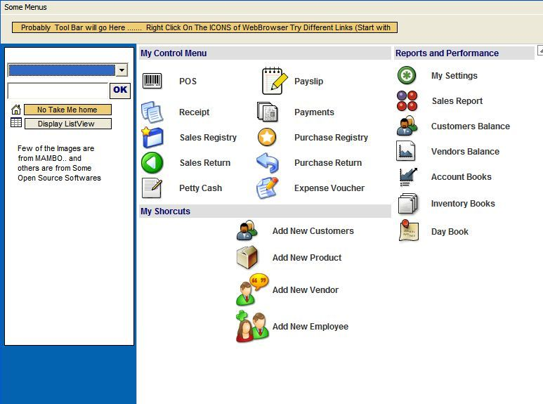



## GUI with MSHTML

### Description

Make Nice Gui with Web Browser control with Help of MSHTML and res protocol..
 
### More Info
 
This is Not a Compelete application.. so bear with me...

You should make a Exe first since too see the Simple Gui .. Basically its just HTML event capturing method.. widely seen here and there..

             |
---                |---
**Submitted On**   |2006-10-31 02:39:32
**By**             |[Ashish Piya](https://github.com/Planet-Source-Code/PSCIndex/blob/master/ByAuthor/ashish-piya.md)
**Level**          |Intermediate
**User Rating**    |4.7 (14 globes from 3 users)
**Compatibility**  |VB 6\.0
**Category**       |[Miscellaneous](https://github.com/Planet-Source-Code/PSCIndex/blob/master/ByCategory/miscellaneous__1-1.md)
**World**          |[Visual Basic](https://github.com/Planet-Source-Code/PSCIndex/blob/master/ByWorld/visual-basic.md)
**Archive File**   |[GUI\_with\_M20278110302006\.zip](https://github.com/Planet-Source-Code/ashish-piya-gui-with-mshtml__1-66933/archive/master.zip)

